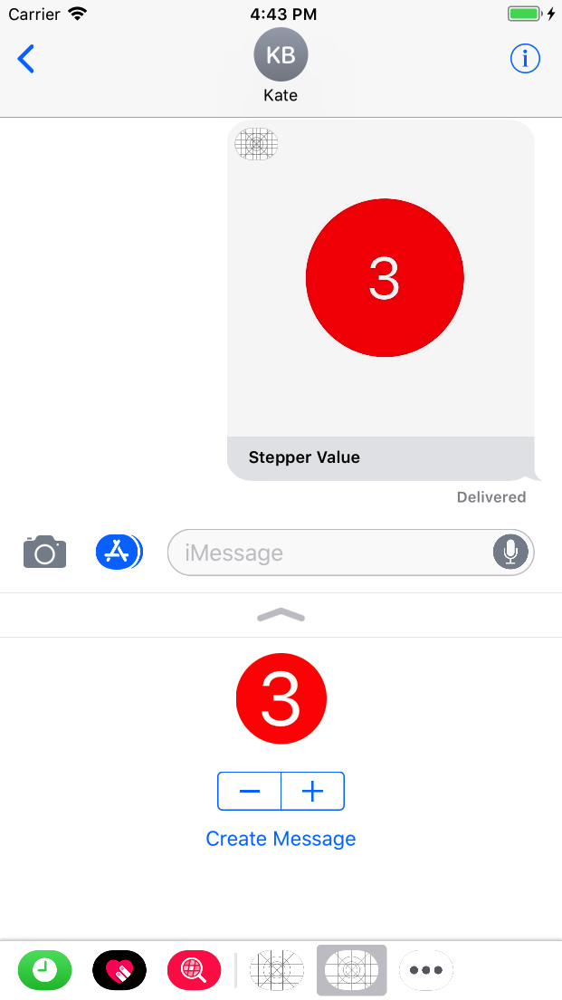
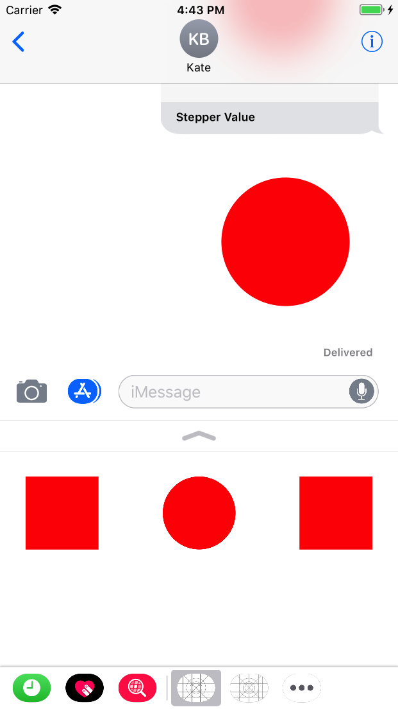

# iMessage App Demo

1. MSConversation
It represents the currently open converation. You can use this class in order to manipulate the conversation transcript, for example by inserting messages or getting the currently selected message.

2. MSMessage
It represents a single message, whether created by you to insert into the conversation or already existing in the conversation

3. MSMessageTemplateLayout
It create a message bubble for you to display your custom message in. It is important to note that the space in the top left of this layout will be filled by your iMessage app's icon.

```Swift
@IBAction func createMessage(_ sender: UIButton) {
	// this gives you access to the active conversation. You can't access the content of messages other than those created by your extension.
	if let image = createImageForMessage(), let conversation = activeConversation {
		let layout = MSMessageTemplateLayout()
		layout.image = image
		layout.caption = "Stepper Value"

		let msg = MSMessage()
		msg.layout = layout
		msg.url = URL(string: "emptyURL")	// This url is intended to link to a web page of some sort where macOS users can also view your custom iMessage content.

		// Insert the message into the current active conversation. Calling this method does not actually send the message, though -- instead it puts your message in the user's entry field so that they can press send themselves.
		conversation.insert(msg, completionHandler: { (error) in
			print(error ?? "OK")
		})
	}
}
```

## Screenshot
<p align="center">
  </img>
</p>


# Sticker Pack App

Create sticker browser

```Swift
func createStickerBrowser() {
	let controller = MSStickerBrowserViewController(stickerSize: MSStickerSize.large)
	addChildViewController(controller)
	view.addSubview(controller.view)

	controller.stickerBrowserView.backgroundColor = UIColor.blue
	controller.stickerBrowserView.dataSource = self

	view.topAnchor.constraint(equalTo: controller.view.topAnchor).isActive = true
	view.leftAnchor.constraint(equalTo: controller.view.leftAnchor).isActive = true
	view.bottomAnchor.constraint(equalTo: controller.view.bottomAnchor).isActive = true
	view.rightAnchor.constraint(equalTo: controller.view.rightAnchor).isActive = true
}
```

## Screenshot
<p align="center">
  </img>
</p>

Happy coding :+1:  :sparkles:
